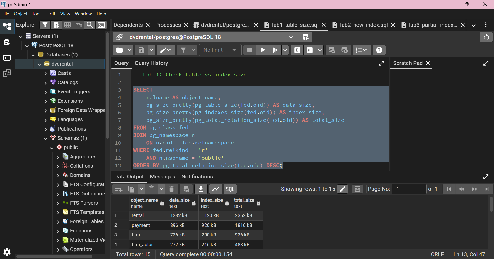
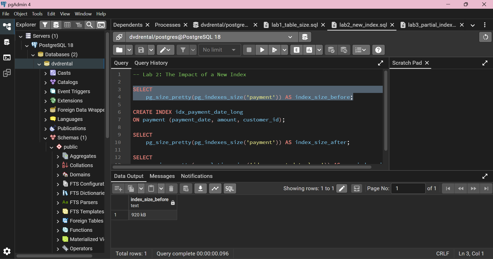
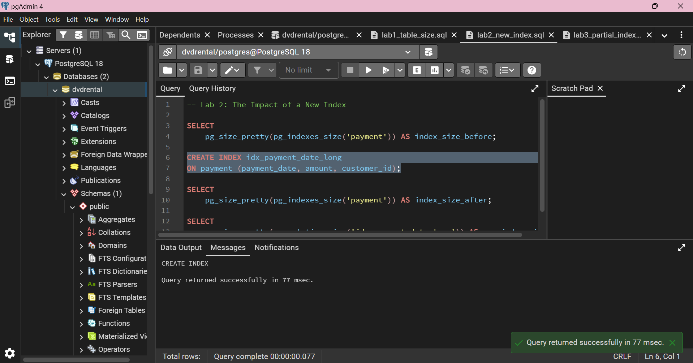
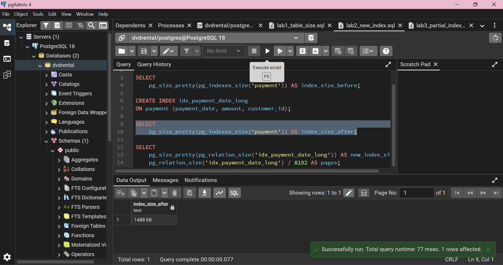
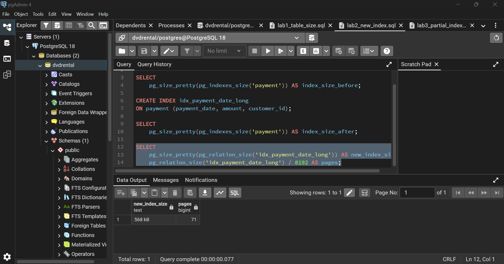
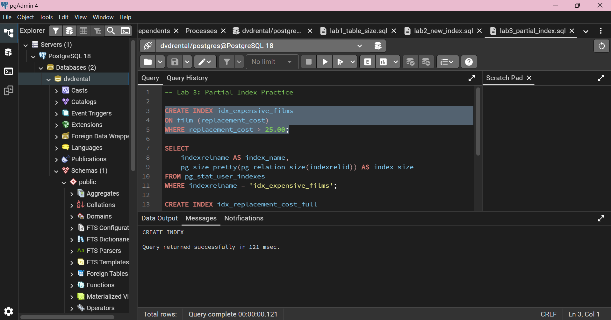
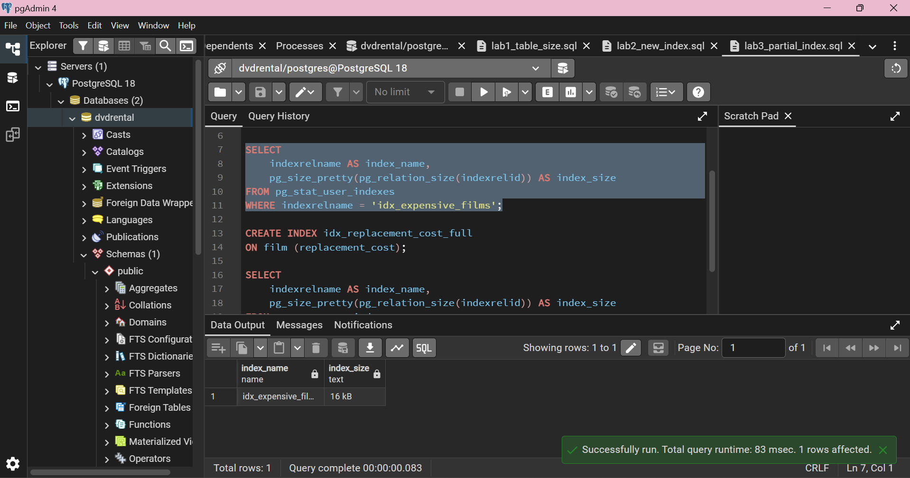
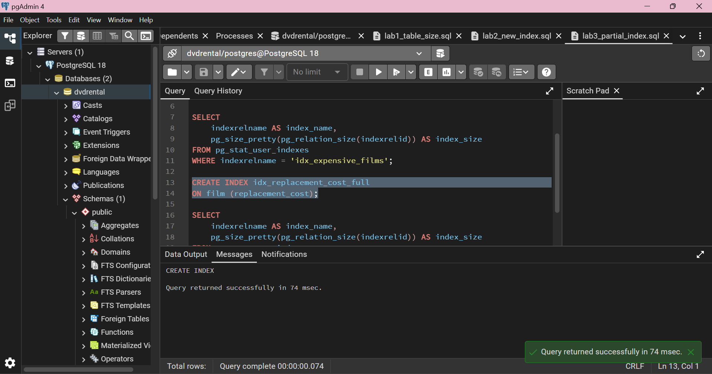
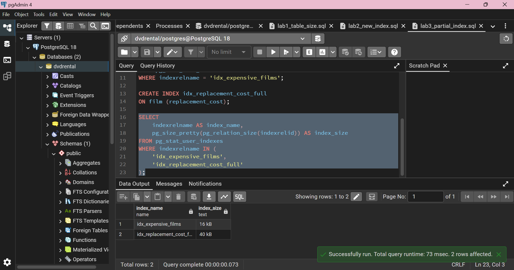

# PostgreSQL Index Labs

PostgreSQL indexing exercises using the `dvdrental` database with PostgreSQL 18 and pgAdmin 4.

This repository contains the SQL scripts, execution screenshots, and PDF report for three labs on PostgreSQL index storage.

## Lab 1: Inspecting Table Size

This lab inspects the data size, index size, and total relation size of tables in the `dvdrental` database to identify tables with significant index storage.

### Key Results

| Table        | Data Size | Index Size | Total Size |
| ------------ | --------: | ---------: | ---------: |
| `rental`     |   1232 kB |    1120 kB |    2352 kB |
| `payment`    |    896 kB |     920 kB |    1816 kB |
| `film`       |    736 kB |     200 kB |     936 kB |
| `film_actor` |    272 kB |     216 kB |     488 kB |

The results show that indexes can occupy a significant amount of storage compared with the table data itself.

**SQL:** [`lab1_table_size.sql`](lab1_table_size.sql)

### Result



---

## Lab 2: The Impact of a New Index

This lab measures the physical storage increase caused by creating a multicolumn index on the `payment` table.

The new index was created on:

```sql
CREATE INDEX idx_payment_date_long
ON payment (payment_date, amount, customer_id);
```

### Key Results

| Measurement         |   Result |
| ------------------- | -------: |
| Index size before   |   920 kB |
| Index size after    |  1488 kB |
| New index size      |   568 kB |
| 8 kB pages consumed | 71 pages |

The total index size increased by:

**1488 kB - 920 kB = 568 kB**

The new index therefore occupies **568 kB**, equivalent to **71 PostgreSQL pages of 8 kB each**.

**SQL:** [`lab2_new_index.sql`](lab2_new_index.sql)

### Results

**1. Index size before creating the new index**



**2. Creating the new index**



**3. Index size after creating the new index**



**4. New index size and number of pages**



---

## Lab 3: Partial Index Practice

This lab compares a partial index with a full index on the `replacement_cost` column of the `film` table.

The partial index only includes rows satisfying:

```sql
replacement_cost > 25.00
```

### Key Results

| Index         |  Size |
| ------------- | ----: |
| Partial index | 16 kB |
| Full index    | 40 kB |

The partial index uses:

**40 kB - 16 kB = 24 kB less storage**

This corresponds to a **60% storage reduction** compared with the full index in this experiment.

**SQL:** [`lab3_partial_index.sql`](lab3_partial_index.sql)

### Results

**1. Creating the partial index**



**2. Partial index size**



**3. Creating the full index**



**4. Partial index vs. full index**



---

## PDF Report

The complete lab report is available here:

**[View PDF Report](11247142_VuongHaiAnh_IndexStorage.pdf)**

---

## Repository Structure

```text
postgresql-index-labs/
│
├── 11247142_VuongHaiAnh_IndexStorage.pdf
├── README.md
├── lab1_table_size.sql
├── lab2_new_index.sql
└── lab3_partial_index.sql
```

## Summary

The three labs demonstrate that:

* Indexes consume physical database storage.
* Creating additional indexes increases storage usage.
* The new index in Lab 2 occupies **568 kB**, or **71 pages**.
* A partial index can use less storage than a full index when only a subset of rows needs to be indexed.
* In Lab 3, the partial index uses **16 kB** compared with **40 kB** for the full index.
